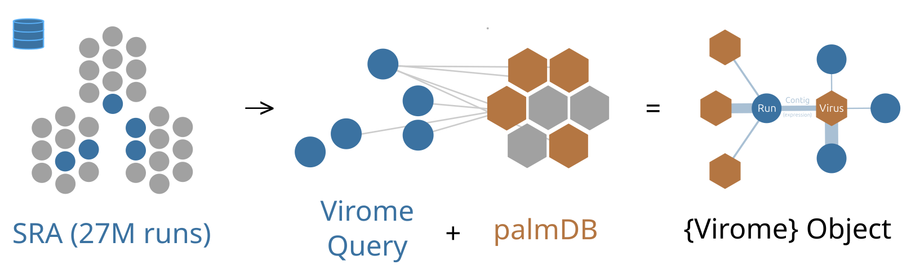

## `open.viromeR` 

`open.viromeR` is an `R` interface for the Open Virome platform.



## Install

```
# R (>= v4.4.0)
install.packages("devtools")
devtools::install_github("ababaian/open.viromeR")
```

(Optional) Visualize graphs in [Cytoscape (>= 3.10.2)](https://cytoscape.org/)

## Usage

Virome Discovery can be performed semi-autonomously with the `openvirome.Rmd` tutorial-notebook.

```
# OV-Analysis Parameters ==============================================
  analysis_name: Eimeria # Short title for analysis
  # ----------------------------------------------------------------------------
  # Virome-Query generation method
  search_type: GENUS # "Genus", "SEARCH", "LIST" or "STAT"                   
  #
  # "GENUS" : Generate Virome by selecting a set of SRA Runs by their taxonomic
  #           Genus (NCBI Taxonomy). Exact match only, includes child-taxa.
  #
  genus_match_term: 'Eimeria'
  #
  # "SEARCH": Generate Virome by an SQL search of the SRA Run metadata for the 
  #           'scientific_name' field. Can include partial-match with '%'.
  #           Exclude matches with the deplete_term
  #
  virome_search_term: 'Eimeria%'
  virome_deplete_term: '%falciformis' # '' for none
  #
  # "LIST"  : Generate a Virome by selecting a set of SRA Run Accessions as they 
  #           listed an input file
  #
  # "STAT"  : Generate a Virome by selecting SRA Run as output by the "SRA-STAT"
  #           tool (see example files)
  #
  input.path: inst/extdata/eimeria.list
  #
  # ----------------------------------------------------------------------------
  # Control-Query generation method (as above)
  # used for creating a "background" set of runs to measure Virome Enrichment
  control_type: BIOPROJECT # '' (none), 'SEARCH', 'LIST', 'BIOPROJECT', 'RANDOM'
  #
  # 'BIOPROJECT' : Control set are virus-negative Runs in the Virome Query
  #
  control_search_term: ''
  control.path: inst/extdata/yeast.list
  ```
